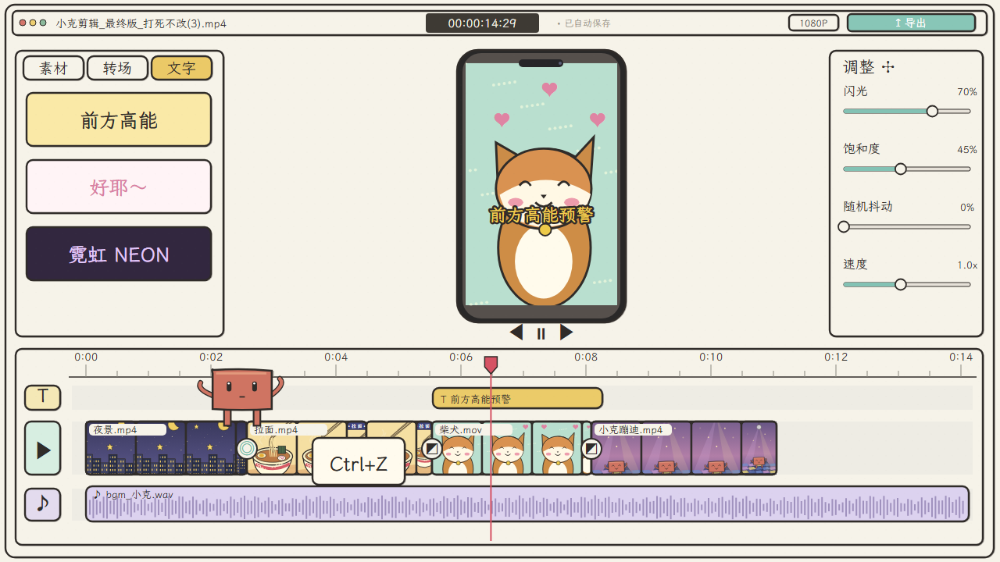

# Claude 剪视频过程 — Remotion 复刻

可编辑的手绘风格剪辑软件动效，依据 Motionface 片段 `e3ee409a-50f7-4b4a-af27-288226e47a57` 重建。



## 运行与渲染

需要 Node.js 22 或更高版本。

```bash
npm ci
npm start
npm run typecheck
npm run still
npm run render
```

Studio 中选择 `EditingStory`。完整输出为 `out/editing-story.mp4`，静帧为 `out/preview.png`。首次渲染时 Remotion 会下载 Chrome Headless Shell。可用 `npm run render -- --concurrency=4` 控制渲染并发。

## 规格与结构

- 1280 × 720，30 fps，902 帧，30.067 秒，H.264 MP4 + AAC 音轨。
- `src/Story.tsx`：SVG 素材、手机、面板、时间线、角色、参数、摄像机与收尾动画。
- `src/Root.tsx`：合成尺寸、帧率、时长。
- `public/reference-audio.m4a`：从用户提供的参考片提取的原音轨，用于保留节奏与同步。
- `@fontsource/lxgw-wenkai`：本地打包的开源霞鹜文楷，渲染前明确等待中文字体加载。
- `docs/analysis.md`：参考片的画面、颜色、构图和时间节奏分析。
- `docs/verification.md`：实际渲染与输出验证记录。

画面由 React/SVG 组件重绘，不使用原视频作为画面背景。它还原参考片的主要构图、风格和事件顺序；插画、手绘线条与部分动作曲线属于近似重建，并非逐像素复制。所有动画由当前帧决定，支持任意帧定位和重复渲染。

## 修改

在 `Story.tsx` 中调整 `cameraKeys` 可改变缩放与平移；`Scene` 提供夜景、拉面、柴犬和舞厅四种画面；`Timeline` 控制素材出现时间；`Bot` 控制角色与手臂目标。无需外部图片服务或运行时密钥。

字体采用 SIL Open Font License，许可证随 npm 依赖提供。参考音轨与原片的权利归原权利人；本项目不另行授予该音轨的使用权。

仓库不包含签名视频地址、网站绑定凭证、GitHub 凭证或完整参考视频。仓库绑定应通过外部授权流程完成，源码不执行绑定请求。
